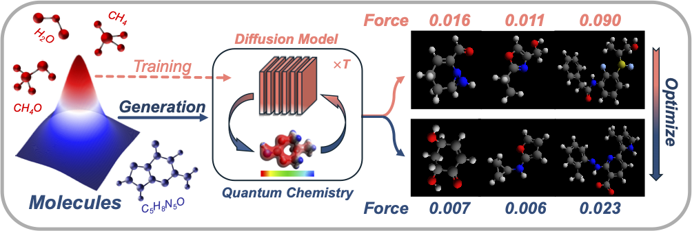

## ChemGuide

[](https://github.com/A-Chicharito-S/ChemGuide/blob/main/LICENSE)
[](https://arxiv.org/abs/2410.06502)



### Overview

_Research Question_

Can we incorporate chemistry knowledge for conditional molecule generation in diffusion models?

_Motivation_
1. training conditional models require a large amount of labeled data, which is time-consuming to acquire for chemistry (e.g., using DFT calculations)
2. (unconditional) diffusion models can be made conditional during inference time via the gradient from posterior p(y|x), where x, y being the molecule and predicted property, respectively.
3. molecule properties are best predicted by chemistry software (e.g., xTB) that is non-differentiable (e.g., can't be backpropagated with neural networks)
4. gradients from a non-differentiable oracle can be estimated using zeroth-order optimization methods

_Conclusion_
1. ChemGuide significantly reduces atomic forces, enhancing the validity of generated molecules when used for stability optimization
2. ChemGuide is compatible with both explicit and implicit guidance in diffusion models, enabling joint optimization of molecular properties and stability
3. ChemGuide generalizes effectively to molecular optimization tasks beyond stability optimization.


### Setup
- environment 
  
  - GeoLDM: please follow the instructions [[here]](https://github.com/MinkaiXu/GeoLDM) to set up the environment for [GeoLDM](https://github.com/MinkaiXu/GeoLDM)
  - xTB guidance: please follow the instructions [[here]](https://xtb-docs.readthedocs.io/en/latest/setup.html#setup) to set up xTB. Note that there are two ways of setting up xTB: xTB-python and xTB, please **don't** use xTB-python, use `Precompiled Binaries from GitHub` instead. To properly install xTB from binaries, please download xTB from Github ([[here]](https://github.com/grimme-lab/xtb/releases)). In this paper, we use version **6.6.1**.
  - metric calculation: 
    - in this work we use metric from GeoLDM [[here]](https://github.com/MinkaiXu/GeoLDM) and autodE [[here]](https://duartegroup.github.io/autodE/index.html). Note that autodE calls xTB to calculate metrics, so please have xTB already installed before using autodE. To speed up autodE, we modified their code to decrease I/O times, please use `autode` directory in our repo. 
    - to calculate the metric, please use the function in `calculate_metric.py` and adapt it to your project.

- data

  please follow the instructions of [GeoLDM](https://github.com/MinkaiXu/GeoLDM) to set up the datasets (i.e., QM9 and GEOM) used in the experiments

- checkpoint

  - unconditional model: we use the model checkpoints released by [GeoLDM](https://github.com/MinkaiXu/GeoLDM)
  - conditional model: we follow the instructions of [GeoLDM](https://github.com/MinkaiXu/GeoLDM) to train conditional versions of GeoLDM and release the checkpoints at [[here]](https://drive.google.com/file/d/1N6aH_A-SMnlGXGzwoCMEV_0jE_BF-z9D/view?usp=sharing). These directories should be put under `outputs` (e.g., `outputs/exp_cond_alpha` for GeoLDM conditioned on property `alpha`)
  - regressor: we follow the instructions of [GeoLDM](https://github.com/MinkaiXu/GeoLDM) to train property regressors / classifiers and release the checkpoints at [[here]](https://drive.google.com/file/d/1A-CtbcSLLBou6EVajuqI7R_3U86oKvkd/view?usp=sharing). These directories should be put under `regressors` (e.g., `regressors/exp_class_alpha` for regressor of property `alpha`)

### Experiment
Explanation:
- `model_path`: specifies the backbone model to use (e.g., unconditional GeoLDM trained on QM9)
- `guidance_step`: specifies the number of steps will be added with guidance until the last diffusion step (e.g., if total diffusion step is 1000 and `guidance_step=400`, meaning the last 400 steps will be added with guidance)
- `clf_scale`: the strength of the guidance
- `package`: the chemistry software used for guidance, currently only `c_line` / `c_line_xxx` (e.g., `c_line_prop` for ChemGuide on molecular property besides force) is supported, in short of command line, which calls xTB using command lines
- `num_samples`: how many molecules to generate in one run
- `every_n_step`: specifies the frequency of the guidance, e.g., `every_n_step=2` means one guidance step will be added every two diffusion steps for the last `guidance_step` of the generation process
- `seed`: sets the random seed of the run, default is None (i.e., no specific random seed is used)
- `run_id`: creates a specific id for the current run, which will be used to save the generated molecules under `eval/xxxx/seed{seed}/generated_mols/{run_id}`
- `property`: specifies molecular properties other than force, can be `{'alpha', 'mu', 'homo', 'lumo', 'gap', 'Cv'}`
- `recurrent_times`: specifies how many times property guidance will be applied within one guidance step
- `bilevel_opti`: whether to use bilevel optimization for forces and other molecular properties
- `bilevel_method`: which property guidance methods (noisy / clean) to use under the bilevel optimization framework
- `clf_scale_force` & `clf_scale_prop`: the guidance strength for force & property under the bilevel optimization framework
- `--use_evolution`: whether to use evolution algorithm (to select molecules with desired properties)


For testing purpose (i.e., fast generation), we set the `guidance_step=4` (in the paper it is 400), `num_samples=3`, and for property guidance, we showcase `property='alpha'`. **One can specify a particular seed using `--seed=xxx` and change `--run_id='xxx'` for different runs**
- unconditional GeoLDM + force guidance (variables: `model_path`, `guidance_step`, `clf_scale`, `num_samples`, suggested: `every_n_step=1`)

  `python eval_sample_xtb.py --model_path='outputs/qm9_latent2' --guidance_step=4 --clf_scale=0.01 --package='c_line' --num_samples=3 --every_n_step=1 --run_id='run0'`
- unconditional GeoLDM + property guidance
  - noisy guidance (variables: `guidance_step`, `clf_scale`, `num_samples`, `property`)
  `python eval_sample_xtb.py --model_path='outputs/qm9_latent2' --guidance_step=4 --clf_scale=0.01 --package='c_line' --num_samples=3 --every_n_step=1 --run_id='run0' --use_neural_guidance --property='alpha'`
  - clean guidance (**`clf_scale_force` should always be 0.0**, variables: `guidance_step`, `clf_scale_prop`, `num_samples`, `property`)
  `python eval_sample_xtb.py --model_path='outputs/qm9_latent2' --guidance_step=4 --package='c_line' --num_samples=3 --every_n_step=1 --run_id='run0' --bilevel_opti --property='alpha' --recurrent_times=1 --clf_scale_force=0.0 --clf_scale_prop=0.01`
- conditional GeoLDM + force guidance (variables: `model_path`, `guidance_step`, `clf_scale`, `num_samples`, `property`, where `property` should match `model_path`)

  `python eval_sample_xtb.py --model_path='outputs/exp_cond_alpha' --guidance_step=4 --clf_scale=0.01 --package='c_line' --num_samples=3 --every_n_step=1 --run_id='run0' --use_cond_geo --property='alpha'`
- bilevel guidance (suggested: `every_n_step=1`, `recurrent_times=1` & `clf_scale_force=0.0001`)
  - noisy guidance (property) + ChemGuide (force) (variables: `guidance_step`, `num_samples`, `property`, `clf_scale_prop`)
  `python eval_sample_xtb.py --model_path='outputs/qm9_latent2' --guidance_step=4 --package='c_line' --num_samples=3 --every_n_step=1 --run_id='run0' --bilevel_opti --property='alpha' --recurrent_times=1 --clf_scale_force=0.0001 --clf_scale_prop=0.01 --bilevel_method='regular_RG'`
  - clean guidance (property) + ChemGuide (force) (variables: `guidance_step`, `num_samples`, `property`, `clf_scale_prop`)
  `python eval_sample_xtb.py --model_path='outputs/qm9_latent2' --guidance_step=4 --package='c_line' --num_samples=3 --every_n_step=1 --run_id='run0' --bilevel_opti --property='alpha' --recurrent_times=1 --clf_scale_force=0.0001 --clf_scale_prop=0.01 --bilevel_method='uni_guide'`
- ChemGuide for property (variables: `model_path`, `guidance_step`, `clf_scale`, `num_samples`, `property`, suggested: `every_n_step=1`)
  
  `python eval_sample_xtb.py --model_path='outputs/qm9_latent2' --guidance_step=4 --clf_scale=0.01 --package='c_line_prop' --num_samples=3 --every_n_step=1 --run_id='run0' --property='alpha'`
- evolution algorithm (variables: `model_path`, `num_samples`, `num_beams`, `check_variants_interval`, suggested: `guidance_step=400`, `clf_scale=0.0001`, `every_n_step=1`)
  
  `python eval_sample_xtb.py --model_path='outputs/qm9_latent2' --guidance_step=400 --clf_scale=0.0001 --package='c_line_evo' --num_samples=3 --every_n_step=1 --run_id='run0' --use_evolution --num_beams=3 --check_variants_interval=20`

### Citation
If you find our work interesting / useful, please consider citing our paper, thank you for your interest in our work!
```
@inproceedings{
shen2025chemistryinspired,
title={Chemistry-Inspired Diffusion with Non-Differentiable Guidance},
author={Yuchen Shen and Chenhao Zhang and Sijie Fu and Chenghui Zhou and Newell Washburn and Barnabas Poczos},
booktitle={The Thirteenth International Conference on Learning Representations},
year={2025},
url={https://openreview.net/forum?id=4dAgG8ma3B}
}
```
